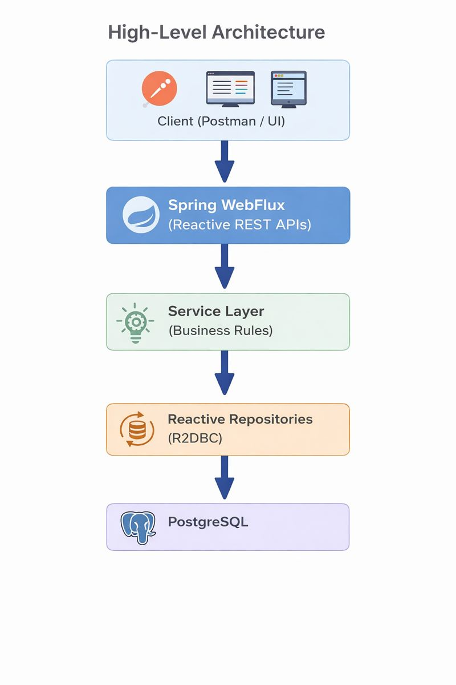

# 📘 Transaction Service – Backend Assignment

This project is a Reactive Transaction Management Service built using __Spring Boot WebFlux__, __R2DBC__, and __PostgreSQL__, supporting secure transaction processing, refunds, analytics, and downloadable reports.

## 🧱 Architecture Overview
### High-Level Architecture



### Key Architectural Decisions
| Area | Choice | Reason |
|------|--------|--------|
Framework | Spring Boot + WebFlux | Non-blocking, scalable
DB Access | R2DBC | Reactive DB access
Security | JWT + RBAC | Stateless & scalable
Authorization | Method-level (@PreAuthorize) | Fine-grained access
Analytics | SQL projections | Efficient aggregations
Reports | Streaming CSV | Memory-safe downloads
Auditing | WebFilter | Centralized logging

## 🔐 Security & RBAC

The service uses JWT-based authentication with role-based access control.

### Roles Supported

1. ADMIN
2. SUPERVISOR
3. CUSTOMER CARE AGENT (AGENT)

### Role Behavior

|Endpoint | ADMIN | SUPERVISOR | AGENT|
|---------|-------|------------|------|
|View transactions | ✅ | ✅ | ✅ |
|Refund transaction | ✅ |✅ | ❌ |
|Analytics | ✅ | ✅ | ❌ |
|Download reports |	✅ | ✅ | ❌ |

Roles are extracted from the JWT roles claim and converted to Spring Security authorities.

### NOTE
For the purposes of a demo, three users were created in three different roles under the `api-gateway` application. But these can be easily removed and replaced with OAuth2 in production grade applications. Due to time constraints I have opted out of using that here.

## 🔁 Core Features
### 1. Transactions

1. Fetch by ID
2. Filter by status, merchant, customer, date range
3. Live transaction feed (SSE)
4. Refunds
5. Partial refunds supported
6. Validation rules enforced:
    - Only SUCCESS transactions
    - No double refunds
    - Refund ≤ original amount
    - Refunds stored as child transactions

### 2. Analytics

1. Transaction summary (success/failed/pending/refunds)
2. Daily transaction trends
3. Refund statistics & percentages

### 3. Reports

1. Downloadable CSV reports
2. Date range filtering
3. Reactive streaming (no memory load)

### 4. Secure access

## 📊 API Overview

Three major API endpoints have been implemented:
1. Transactions under `/api/transactions`
2. Analytics under `/api/analytics`
3. Reports under `/api/reports`

The detailed paths and their functions are given in the API Documentation which is available in Swagger UI http://localhost:8081/swagger-ui.html

The raw JSON can be found at OpenAPI JSON: http://localhost:8081/v3/api-docs

## ⚙️ Configuration
application.yml (for a single application)
```
server:
  port: 8081

spring:
  application:
    name: transaction-service

  webflux:
    base-path: /api

  r2dbc:
    url: r2dbc:postgresql://localhost:5432/db_name
    username: postgres
    password: your_password

  security:
    oauth2:
      resourceserver:
        jwt:
          secret-key: your_secret_key
```

## ▶️ How to Run the Project
### Prerequisites

1. Java 17+
2. PostgreSQL
3. Gradle

### Steps
1. Clone the repo
```
$ git clone <repo-url>
```
2. Enter the directory for each application on separate terminals
```
$ cd transaction-service
$ cd api-gateway
```

3. In both terminals, run the application, so that both the gateway and the service starts.
```
$ ./gradlew clean bootRun
```

5. The transaction service gets started on: http://localhost:8081/api

6. But it is inaccessible (except the swagger docs), and can be accessed by the secured TLS port which runs the api gateway on: https://localhost:8443

7. All calls that start with `/api` gets redirected to the transaction service for further execution.

## 🧪 Testing

1. APIs were tested using Postman
2. JWT tokens used for role validation
3. Edge cases verified:
    - Invalid refunds
    - Unauthorized access
    - Empty analytics results

## 📌 Assumptions

1. PostgreSQL runs locally
2. JWT secret is symmetric (HMAC)
3. Transactions are immutable except refunded flag
4. Refunds are represented as negative transactions

## ✅ Deliverables Checklist

✅ Source code (GitHub)

✅ Swagger API documentation

✅ Role-based security

✅ Analytics & reports

✅ README with architecture & run instructions

## 🏁 Final Notes

This project demonstrates:
1. Reactive programming
2. Secure API design
3. Streaming large responses safely
4. Clean separation of concerns